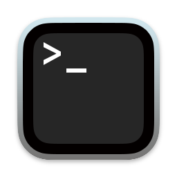

<p align="center">
  
</p>

# ccshell

A complex (or simple?) shell implemented in C++ (some C codes (job control) will be replaced by C++ soon, but anyway C is still subset of C++)

NO vibe coding / AI / Codex / Claude Code / Antigravity / Cursor / Kiro

Only the very traditional methods (stack overflow, man, cpp reference, etc.) are used

👉 I am just learning these stuff as doing this project, so if you find something stupid, please just open issue/PR 😭

~~Very simple and boring things (just job CRUD, really) are copied from CS:APP (I did that lab, so they're here), but will be refactored soon~~ 👉 Job system will be rewritten, because CSAPP job model is not how sh/bash/zsh works, and then it will be in C++

## Feature

Support very complex syntax with a systematic language analysis system (it is implemented with recursion, thus it would not have any problems with long command)
- async command (aka background)
- logic operators based on exit value
- brackets
- multiple commands
- TODO: pipeline, expansion, etc.

A fantastic line editor has been DONE, and it will be adapted very SOON! 😘

## Build

👉 ISO C++26 is used, please make sure gcc-14 or above is installed, and gcc-15/16 is most recommended 

(clang doesn't work well, don't use it!)

```sh
make magic-enum # download dependencies
make # build project
```

## Usage

Valid options can be found here `include/option.h`

Or just run without any options

```sh
build/ccshell
```

## Development 

ignore the test file (deprecated)
```sh
git update-index --skip-worktree src/test.cc
```

## Legal info

Copyright (C) _ov4

This is free software; see the source for copying conditions. There is NO warranty; not even for MERCHANTABILITY or FITNESS FOR A PARTICULAR PURPOSE.
